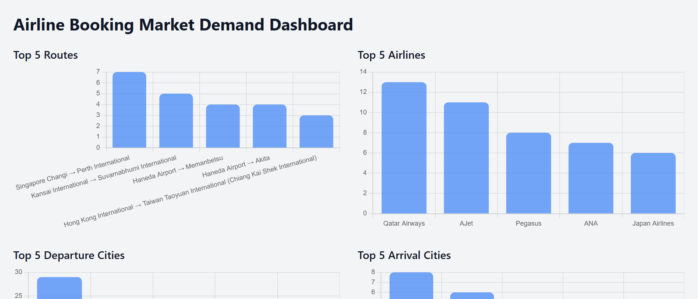

# Snapshots



# ✈️ Airline Booking Market Demand Dashboard

This project is a Python Flask-based web app that visualizes airline booking trends such as:

- Top 5 most popular routes
- Top departure and arrival cities
- Most active airlines
- High-demand travel dates
- Simulated average price trends per route

## 📊 Tech Stack

- Python 3
- Flask
- Requests
- Tailwind CSS (for UI styling)
- AviationStack API (free-tier flight data)

---


## 📦 Setup Instructions

1. Clone this repo:
```bash
git clone https://github.com/saklen077/airline-demand-dashboard.git
cd airline-market-demand-dashboard
```

2. Create a virtual environment:
```bash
python -m venv venv
source venv/bin/activate  # Windows: venv\Scripts\activate
```

3. Install dependencies:
```bash
pip install -r requirements.txt
```

4. Replace your API key:
Open `app.py` and replace:
```python
API_KEY = "YOUR_API_KEY"
```

5. Run the app:
```bash
python app.py
```

Then go to: `http://localhost:5000`

---

## 📍 API Used

- [AviationStack API](https://aviationstack.com/) - Free-tier airline data

---
